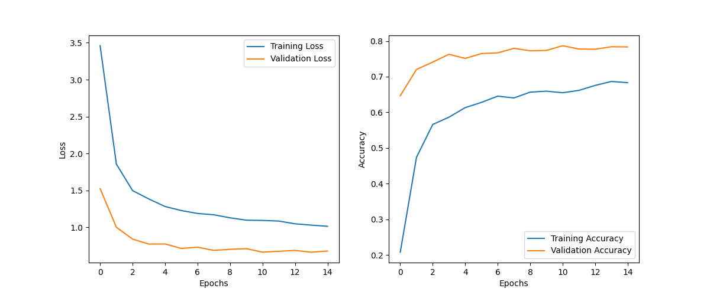
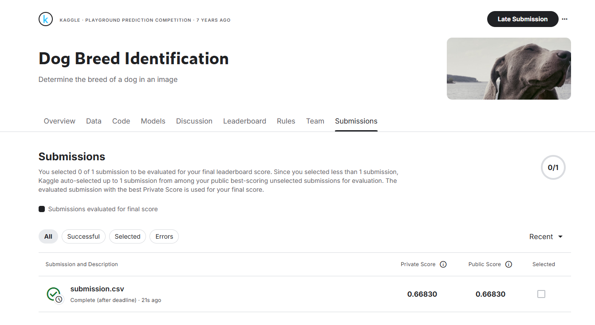

# 狗品種識別分類器

## 資料集下載與準備

1. 前往 Kaggle 競賽頁面：https://www.kaggle.com/competitions/dog-breed-identification/data
2. 點擊「Download All」按鈕下載資料集（需要 Kaggle 帳號）
3. 解壓縮下載的 zip 檔案到專案根目錄
4. 確保以下檔案結構：
   - `train/` - 包含訓練圖像
   - `test/` - 包含測試圖像
   - `labels.csv` - 訓練標籤
   - `sample_submission.csv` - 提交格式範例

注意：資料集大小約為 700MB，請確保有足夠的磁碟空間和網路頻寬。


此專案是使用深度學習(CNN)來識別120種不同狗品種的圖像分類器。使用PyTorch框架與預訓練的ResNet-50模型實現。

## 專案概述

本專案的主要目標是根據狗的圖像準確預測其品種。資料集包含了120種不同的狗品種，比賽任務是建立一個分類器，能夠從照片中確定狗的品種。

## 資料集

資料集包括以下文件：
- `train/` - 訓練資料集，包含狗的圖像和對應的品種標籤
- `test/` - 測試資料集，需要預測每張圖片屬於各品種的機率
- `labels.csv` - 訓練集中每張圖像的品種標籤
- `sample_submission.csv` - 提交格式範例

## 解決方案

### 模型架構
- 使用預訓練的ResNet-50作為基礎模型
- 修改頂層全連接層以適應120種狗品種的分類任務
- 使用遷移學習技術：凍結大部分卷積層，只訓練後面幾層和新增加的全連接層

### 資料增強
為提高模型泛化能力，使用了以下資料增強技術：
- 隨機水平翻轉
- 隨機旋轉
- 亮度、對比度和飽和度調整

### 訓練策略
- 使用交叉熵損失函數
- Adam優化器，不同層使用不同學習率
- 學習率調度器：ReduceLROnPlateau
- 早停機制：保存驗證準確率最高的模型

## 使用方法

1. 確保`train`、`test`資料夾和`labels.csv`都在正確路徑
2. 安裝所需套件：
```
pip install torch torchvision numpy pandas matplotlib scikit-learn tqdm pillow
```
3. 執行訓練和預測：
```
python dog_breed_classifier.py
```
4. 訓練完成後，會生成：
   - `best_model.pth`：最佳模型權重
   - `training_history.png`：訓練過程曲線圖
   - `submission.csv`：預測結果（可用於提交）

## 專案檔案說明

| 檔案名稱 | 說明 |
|---------|------|
| `dog_breed_classifier.py` | 主要程式碼，包含資料處理、模型定義、訓練和預測流程 |
| `README.md` | 專案說明文件，提供概述、使用方法和結果說明 |
| `Changelog.md` | 變更日誌，記錄模型版本和改進歷史 |
| `requirements.txt` | 依賴套件列表，指定所需的Python套件版本 |
| `best_model.pth` | 訓練好的模型權重檔案，保存了驗證準確率最高的模型參數 |
| `training_history.png` | 訓練過程曲線圖，顯示損失和準確率的變化 |
| `firstSubmission.png` | 提交結果圖，顯示在Kaggle上的提交分數 |
| `labels.csv` | 訓練集標籤檔案，包含每張圖片的ID和對應品種 |
| `sample_submission.csv` | Kaggle提供的提交格式範例 |
| `submission.csv` | 根據模型預測生成的提交檔案，用於Kaggle評分 |
| `.gitignore` | Git版本控制忽略設定，排除不必要的檔案 |

## 效能

模型在15個訓練周期後達到了良好的分類效果：

### 訓練結果
- **最佳驗證準確率**：78.68%（在第11個epoch）
- **最終訓練準確率**：68.31%（在第15個epoch）
- **最終驗證準確率**：78.34%（在第15個epoch）

### 訓練過程

訓練過程中的損失和準確率曲線如下：



### 提交結果

根據模型在測試集上的預測生成的提交結果：

 